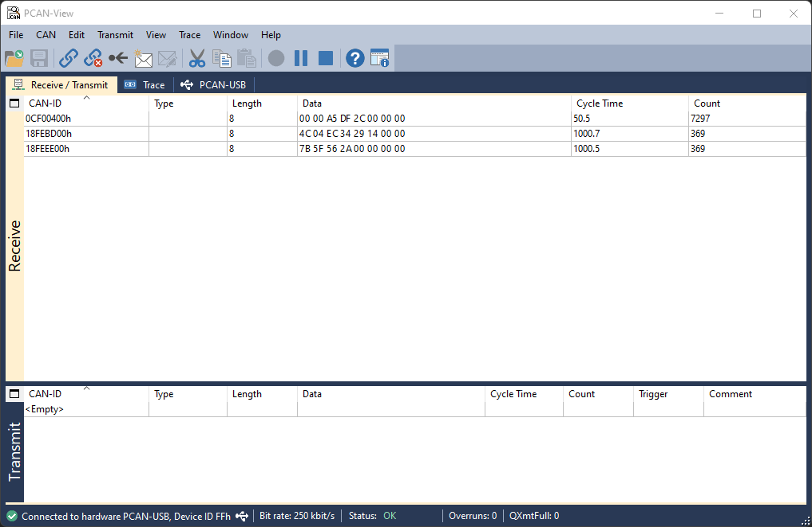

# akrocansim
Akrocansim is a CAN bus controller simulator offering a graphical interface for manipulating transmitted signals.

Currently, there is partial support for J1939.

Akrocansim is built using [DearPyGUI](https://github.com/hoffstadt/DearPyGui) and [python-can](https://github.com/hardbyte/python-can).

